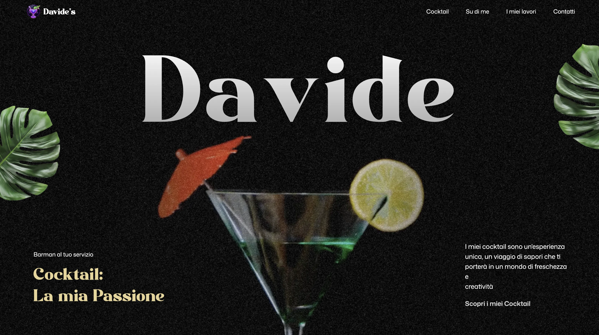

# Davide's Cocktail Bar

Animated landing page for a fictional bartender, built as a GSAP course exercise with scroll-driven motion, pinned sections, video scrubbing, and mask reveals.



## Demo

- Live site: [gsap-cocktails-three-zeta.vercel.app](https://gsap-cocktails-three-zeta.vercel.app/)
- Repository: [github.com/matterconi/gsap_cocktails](https://github.com/matterconi/gsap_cocktails)

## Features

- ScrollTrigger timelines for section-by-section storytelling
- SplitText entrance animations for headings and copy
- Pinned animation sequences with scrubbed progress
- Circular image mask reveal in the art section
- Responsive layout for desktop and mobile
- Cocktail menu interactions with animated image/detail changes

## Tech Stack

- React 19
- Vite 7
- GSAP 3.13
- GSAP ScrollTrigger
- GSAP SplitText
- @gsap/react
- Tailwind CSS v4
- react-responsive

## Getting Started

```bash
npm install
npm run dev
```

Open the local URL printed by Vite.

## Scripts

```bash
npm run dev
npm run build
npm run lint
npm run preview
```
